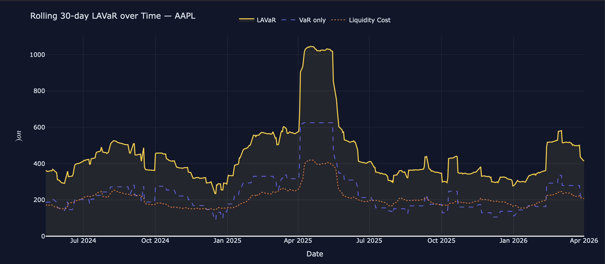
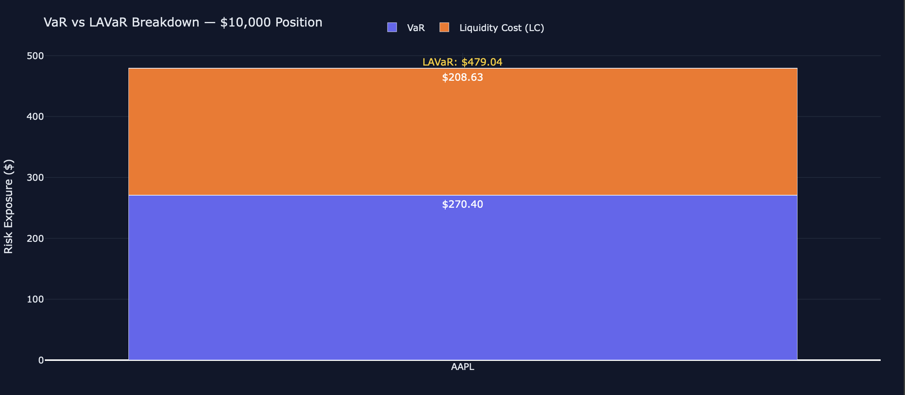
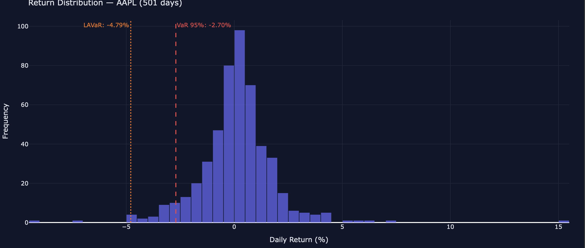
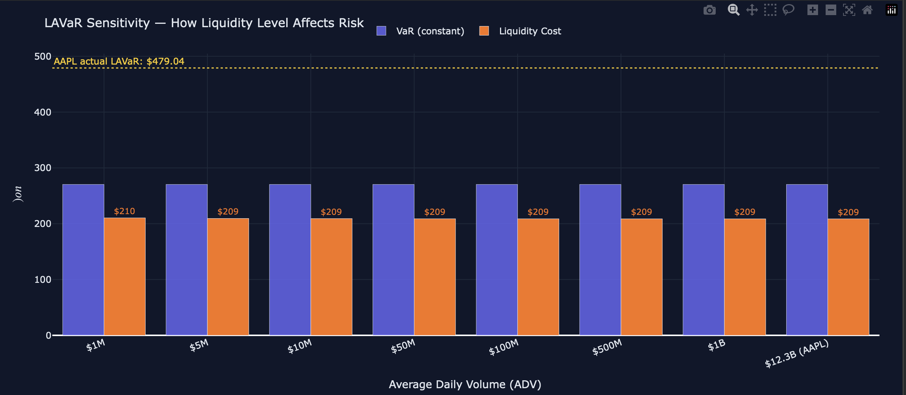

# Liquidity-Adjusted Value at Risk (LAVaR) 

[](https://python.org)
[](https://plotly.com)
[](LICENSE)
[](https://yourusername.github.io/lavar-dashboard)

> A Python-based quantitative risk framework that extends classical Value at Risk (VaR) with a liquidity adjustment component, producing a holistic single-number risk metric — **LAVaR** — that captures both market risk and the cost of unwinding a position under real-world conditions.

---

## Table of Contents
- [Overview](#overview)
- [The Problem with Classical VaR](#the-problem-with-classical-var)
- [Theoretical Framework](#theoretical-framework)
  - [Value at Risk (VaR)](#1-value-at-risk-var)
  - [Liquidity Cost (LC)](#2-liquidity-cost-lc)
  - [The LAVaR Formula](#3-the-lavar-formula)
- [Mathematical Derivation](#mathematical-derivation)
  - [Historical Simulation VaR](#historical-simulation-var)
  - [Bid-Ask Spread Cost](#bid-ask-spread-cost)
  - [Market Impact — Almgren Square-Root Model](#market-impact--almgren-square-root-model)
  - [Full LAVaR Expression](#full-lavar-expression)
- [Results Interpretation](#results-interpretation)
- [Project Structure](#project-structure)
- [Data Pipeline](#data-pipeline)
- [Dashboard](#dashboard)
- [Limitations and Future Work](#limitations-and-future-work)
- [References](#references)

---

## Overview
Classical VaR answers the question: *"How much can I lose over a given horizon at a given confidence level?"* It is the cornerstone of market risk management, mandated by regulators globally under Basel II/III frameworks. However, it has a well-documented blind spot — it assumes you can exit your position instantaneously and at zero cost, which is never true in real markets.

**LAVaR** closes this gap. It asks a more complete question:  
> *"How much will I lose — including the cost of actually getting out of this position — over a given horizon at a given confidence level?"*

This project implements the full LAVaR pipeline from raw market data to an interactive GitHub Pages dashboard:
- Fetches 2 years of daily price and volume data via `yfinance`
- Computes historical simulation VaR at 95% confidence
- Estimates liquidity cost via bid-ask spread proxy and the Almgren square-root market impact model
- Produces LAVaR = VaR + LC
- Generates four interactive Plotly charts embedded in a single self-contained `index.html`

The resulting dashboard is deployable on GitHub Pages with zero backend — all computation happens in Python/Colab, all chart data is embedded as JSON at build time.

---

## The Problem with Classical VaR
VaR, in its standard form, treats a portfolio position as if it exists in frictionless markets. This assumption breaks down in several important scenarios:

**Illiquid assets** — small-cap equities, corporate bonds, real estate investment trusts, commodity futures in thinly traded months.  
**Stressed markets** — during periods of elevated volatility (e.g., the COVID crash of March 2020, the AAPL tariff selloff of April–May 2025), bid-ask spreads widen dramatically.  
**Large relative positions** — when your trade size represents a significant portion of daily volume.

Ignoring these frictions leads to systematic underestimation of true downside risk. LAVaR quantifies precisely how large this underestimation is.

---

## Theoretical Framework

### 1. Value at Risk (VaR)
VaR is defined as the maximum potential loss over a holding period $T$ at confidence level $\alpha$, such that the probability of exceeding this loss is $(1-\alpha)$.

For a position of size $W$ with return $r$:
$$
\text{VaR}_\alpha(\$ ) = W \cdot |q_{1-\alpha}(r)|
$$
where $q_{1-\alpha}(r)$ is the $(1-\alpha)$-th quantile of the return distribution.

This project uses **historical simulation** — the empirical quantile of observed returns — rather than parametric methods. It makes no distributional assumptions and naturally captures fat tails, skewness, and volatility clustering.

### 2. Liquidity Cost (LC)
LC represents the total transaction cost of unwinding the position. It has two components:

**a) Bid-Ask Spread Cost**  
We use the daily High-Low range as a proxy for the effective spread (Parkinson/Corwin-Schultz inspired):
$$
\hat{S}_t = \frac{H_t - L_t}{C_t}
$$
Average spread:
$$
\bar{S} = \frac{1}{N} \sum_{t=1}^{N} \hat{S}_t
$$

**b) Market Impact Cost**  
Implemented using the **Almgren-Chriss (2001) square-root market impact model**:
$$
\text{MarketImpact} = \eta \cdot \sigma \cdot \sqrt{\frac{W}{\bar{V}}}
$$
where $\eta = 0.1$, $\sigma$ is daily volatility, $W$ is position size (in $), and $\bar{V}$ is average daily dollar volume.

### 3. The LAVaR Formula
$$
\text{LAVaR}(\$) = W \cdot \left[ |q_{1-\alpha}(r)| + \bar{S} + \eta \cdot \sigma \cdot \sqrt{\frac{W}{\bar{V}}} \right]
$$

---

## Mathematical Derivation

### Historical Simulation VaR
Given a time series of $N$ daily log-returns, sort them in ascending order:
$$
r_1 \leq r_2 \leq \cdots \leq r_N
$$

The 95% VaR is the return at rank $k$, where $k = \lfloor 0.05 \times N \rfloor$:
$$
\text{VaR}_{95\%} = -r_k
$$

For $N = 501$ trading days, $k = \lfloor 0.05 \times 501 \rfloor = 25$:
$$
\text{VaR}_{95\%} = -r_{25}
$$

### Bid-Ask Spread Cost
Using daily OHLC data:
$$
\hat{S}_t = \frac{H_t - L_t}{C_t}, \quad \bar{S} = \frac{1}{N} \sum_{t=1}^{N} \hat{S}_t
$$
Dollar spread cost on position $W$:
$$
\text{SpreadCost}(\$) = \bar{S} \cdot W
$$

### Market Impact — Almgren Square-Root Model
Define:
- $\bar{V}$ = average daily dollar volume (ADV)
- $\sigma$ = daily return volatility
- $\phi = \frac{W}{\bar{V}}$ (participation rate)

Market impact as fraction of price:
$$
\text{MI} = \eta \cdot \sigma \cdot \sqrt{\phi} = 0.1 \cdot \sigma \cdot \sqrt{\frac{W}{\bar{V}}}
$$
Dollar market impact:
$$
\text{MI}(\$) = \text{MI} \cdot W
$$

### Full LAVaR Expression
$$
\text{LAVaR}(\$) = \text{VaR}(\$) + \text{SpreadCost}(\$) + \text{MI}(\$)
$$

---

## Results Interpretation

| Metric                        | Value          | Interpretation                                      |
|-------------------------------|----------------|-----------------------------------------------------|
| VaR (95%, 1-day)              | $270.40 (2.704%) | On 95% of days, losses stay below this level       |
| Liquidity Cost                | $208.63 (2.086%) | Cost to exit position at average market conditions |
| **LAVaR (95%, 1-day)**        | **$479.03 (4.790%)** | **True downside including exit frictions**        |
| LC Share of LAVaR             | 43.55%         | Liquidity premium — how much VaR understates risk  |
| Avg Bid-Ask Spread Proxy      | 2.086%         | Average daily High-Low range as spread proxy       |
| Avg Daily Volume              | $12.33B        | AAPL is highly liquid; market impact is negligible |

**Rolling LAVaR Observations**  
The rolling 30-day chart reveals several important dynamics:
- Baseline LAVaR of ~$350–420 during normal market conditions.
- Spike to ~$1,050 in April–May 2025 during the AAPL tariff-driven selloff.
- LC tracks VaR directionally, showing that liquidity costs compound during stress periods.
- LAVaR always exceeds VaR, with the premium becoming larger in volatile regimes.

**Sensitivity Analysis**  
For the same $10,000 position:

| ADV          | Market Impact | Total LC   | LAVaR    |
|--------------|---------------|------------|----------|
| $1M (micro-cap)   | ~1.79%       | ~3.87%    | ~6.57%  |
| $10M (small-cap)  | ~0.57%       | ~2.65%    | ~5.35%  |
| $100M (mid-cap)   | ~0.18%       | ~2.26%    | ~4.97%  |
| $12.3B (AAPL)     | ~0.000%      | ~2.09%    | ~4.79%  |

---

## Project Structure
 
```
lavar-dashboard/
│
├── index.html                  # Self-contained dashboard (deploy to GitHub Pages)
│
├── notebooks/
│   └── lavar_pipeline.ipynb    # Full Google Colab notebook
│
├── assets/
│   └── graphs/                 # Chart screenshots
│       ├── chart1_return_distribution.png
│       ├── chart2_var_lavar_bar.png
│       ├── chart3_rolling_lavar.png
│       └── chart4_adv_sensitivity.png
│
└── README.md                   # This file
```
 
All computation is performed in the Colab notebook. The `index.html` file is fully self-contained — all chart data is embedded as JSON, requiring no server, no API calls, and no external data dependencies beyond the Plotly.js CDN.
 
---
 
## Data Pipeline
 
```
yfinance (2yr daily OHLCV)
        │
        ▼
  Clean & validate
  (drop NaNs, compute returns)
        │
        ├──────────────────────┐
        ▼                      ▼
   Historical              Spread proxy
   returns                 (High-Low/Close)
        │                      │
        ▼                      ▼
  95th percentile        Average spread +
  VaR calculation        Almgren impact
        │                      │
        └──────────┬───────────┘
                   ▼
             LAVaR = VaR + LC
                   │
                   ▼
          Rolling 30-day series
          + Sensitivity scenarios
                   │
                   ▼
         Plotly charts → JSON
                   │
                   ▼
         Embedded in index.html
```
 
**Libraries used:**
 
| Library | Purpose |
|---------|---------|
| `yfinance` | OHLCV data download |
| `pandas` | Time series manipulation |
| `numpy` | Quantile computation, rolling statistics |
| `plotly` | Interactive chart generation |
| `json` | Chart serialisation for embedding |
 
---
 
## Dashboard
 
The `index.html` dashboard contains four interactive charts:
 
**Chart 1 — Return Distribution**
Histogram of daily returns with vertical lines marking the VaR (95%) and LAVaR thresholds. Visually demonstrates how LAVaR sits further into the left tail than VaR alone.
 

 
**Chart 2 — VaR vs LAVaR Stacked Bar**
Stacked bar showing VaR (purple) and LC (orange) as components of total LAVaR. The annotation labels the total LAVaR in yellow. Communicates the LC-to-LAVaR ratio at a glance.
 

 
**Chart 3 — Rolling 30-day LAVaR**
Time series of rolling LAVaR, VaR, and LC over the 2-year sample. Captures regime changes, stress periods, and the co-movement of market risk and liquidity risk.
 

 
**Chart 4 — ADV Sensitivity**
Grouped bar chart showing how VaR (constant) and LC (varies) respond to different assumed average daily volumes, from $1M (micro-cap) to $12.3B (AAPL). Demonstrates the model's applicability beyond large-cap stocks.
 

 
---
 
## Limitations and Future Work
 
**Current limitations:**
 
- Spread proxy using High-Low range overestimates true bid-ask spread for liquid stocks. Production implementations should use TAQ (Trade and Quote) data or WRDS for intraday bid-ask data
- Single-asset only. Portfolio extension requires modelling correlated liquidity shocks across positions
- 1-day holding period. Regulatory VaR (Basel) uses 10-day; scaling by $\sqrt{10}$ is approximate and assumes i.i.d. returns
- Historical simulation is backward-looking; it will not capture a stress regime not present in the 2-year window
- The Almgren $\eta = 0.1$ constant is empirically calibrated on US equities; it may not transfer to other asset classes
 
**Planned extensions:**
 
- Multi-asset portfolio LAVaR with correlation matrix
- Parametric and Monte Carlo VaR alternatives with method comparison
- Conditional VaR (CVaR / Expected Shortfall) as a complement to LAVaR
- Intraday spread data integration (WRDS/TAQ) for more accurate spread estimation
- Live ticker input on the dashboard — re-compute and re-render without Colab
- Backtesting module: Kupiec proportion-of-failures test and Christoffersen interval forecast test for VaR model validation
 
---
 
## References
 
1. **Almgren, R. & Chriss, N. (2001).** Optimal execution of portfolio transactions. *Journal of Risk*, 3(2), 5–39.
 
2. **Amihud, Y. (2002).** Illiquidity and stock returns: Cross-section and time-series effects. *Journal of Financial Markets*, 5(1), 31–56.
 
3. **Basel Committee on Banking Supervision (2019).** Minimum capital requirements for market risk (FRTB). Bank for International Settlements.
 
4. **Corwin, S.A. & Schultz, P. (2012).** A simple way to estimate bid-ask spreads from daily high and low prices. *Journal of Finance*, 67(2), 719–760.
 
5. **Jorion, P. (2006).** *Value at Risk: The New Benchmark for Managing Financial Risk* (3rd ed.). McGraw-Hill.
 
6. **Kyle, A.S. (1985).** Continuous auctions and insider trading. *Econometrica*, 53(6), 1315–1335.
 
7. **Parkinson, M. (1980).** The extreme value method for estimating the variance of the rate of return. *Journal of Business*, 53(1), 61–65.
 
8. **Stange, S. & Kaserer, C. (2009).** Market liquidity risk — an overview. *CEFS Working Paper*.
 
---
 
*Built as part of a quantitative finance portfolio project. Data sourced via yfinance (Yahoo Finance). For educational and research purposes only. Not investment advice.*
 
